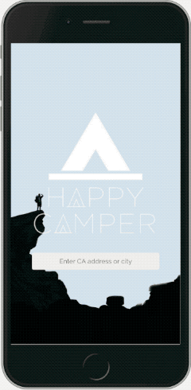
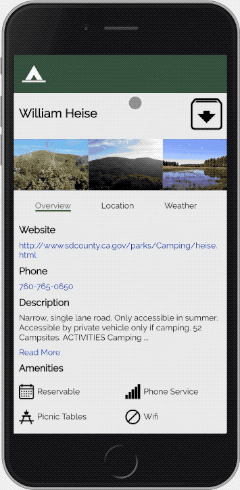
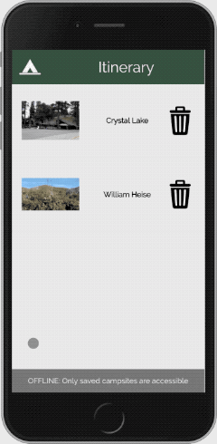

# Happy Camper
> Mobile first application that allows users to search for campsites in California and save information for offline usage.

Users can input a California location into the auto-complete search bar and get back a list of campground results.

Clicking one of the results reveals information on the campsite such as photos, amenities, directions, and weather.

Use the icon next to the campground name to save it into itinerary. Clicking trash can icons will remove the item from the itinerary.

This site implements service workers to save data into the browser cache for offline accessibilities akin to a progressive web app.

## Installation

> 1. Clone repo
>    - `git clone https://github.com/Learning-Fuze/c718_findcampsiteinfo`
> 1. Change directory into the newly cloned repo
>    - `cd c718_findcampsiteinfo`
> 1. Install dependencies
>    - `npm install`
> 1. Copy data to MySQL database with queries from `dist/server/data/happycamp_rev1.sql`
> 1. Navigate to `dist/server/backendAPI/mysql_connect.php.config` and configure file with your mysql info as `mysql_connect.php`
> 1. Start dev server
>    - `npm start`
> 1. Open a browser and navigate to `localhost:3000`

## Authors

*Front End Developers*
Randy Dang [https://github.com/dangrt5](https://github.com/dangrt5)
Rachel Pan [https://github.com/rpan06/](https://github.com/rpan06/)

*Back End Developers*
David Ahn [https://github.com/d-ahn10](https://github.com/d-ahn10)
Hank Kim [https://github.com/citation0097](https://github.com/citation0097)
